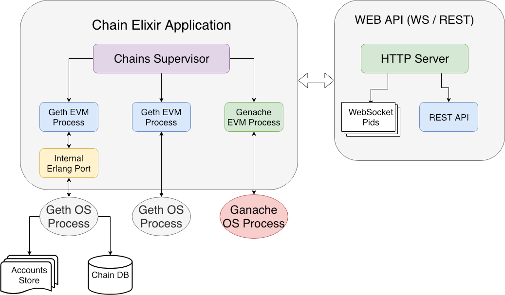

# TestChain

This is Elixir MVP implementation of Testchain as a Service.

Right now it implements this features:
 
 - Start/stop new chain (`geth|ganache`)
 - Start/Stop mining process
 - Take/revert snapshot

## Requirements

 - Elixir 1.7+
 - Erlang 21+

## Installation

As for now project requires Elixir installed + chain you want to work with.

[**Installing Elixir**](https://elixir-lang.org/install.html)

For NixOS you will also need to install Erlang R21 to make `escript` available
```bash
$ nix-env -iA nixos.erlangR21
```

### Geth
ExTestchain uses `geth` installed in your system.

[**Installation**](https://github.com/ethereum/go-ethereum/wiki/Installing-Geth)

After this `geth` should be available in your system.

### Ganache
ExTestchain uses local ganache-cli installation.

Installing ganache locally:

```bash
$ cd priv/presets/ganache
$ npm install
```

## How it's working



## Building

First you need to install dependencies. For elixir project it's done using command:
```bash
$ mix do deps.get, deps.compile
```

To build project you can use:

```bash
$ mix compile
```

To run it locally: 
```bash
$ iex -S mix phx.server
```

This command will start project locally and spawn a HTTP/WS server on port `4000`

And it will become accesible from anywhere you need.
## Logging
For now ExTestchain uses logger in debug mode and all messages will be printed to your CLI.
To omit this uncomment logger level in `apps/chain/config/config.ex`

```elixir
config :logger, level: :info
```

And recompile your project

Happy testing ! :ghost:
